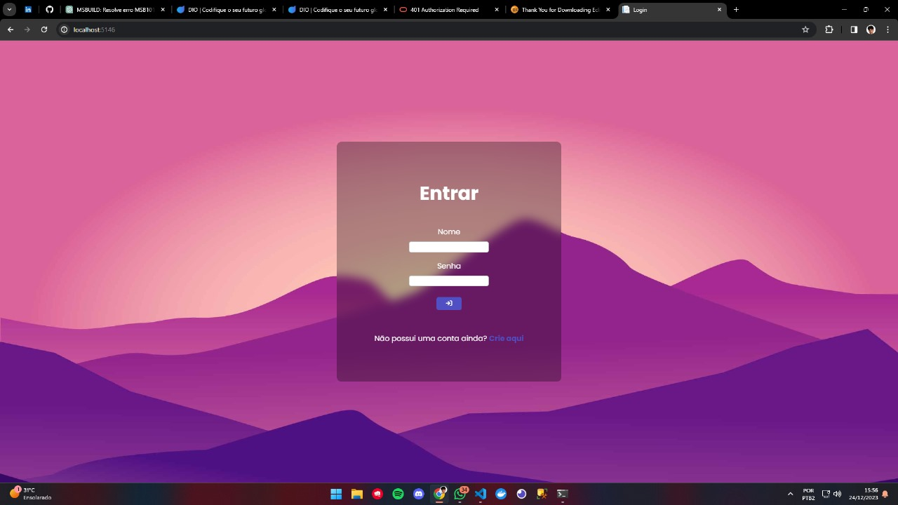
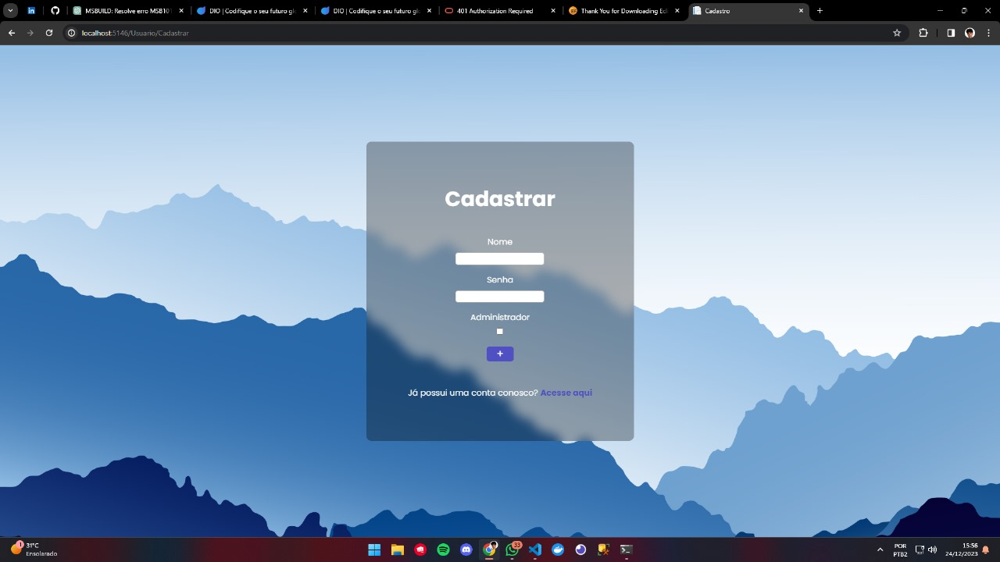
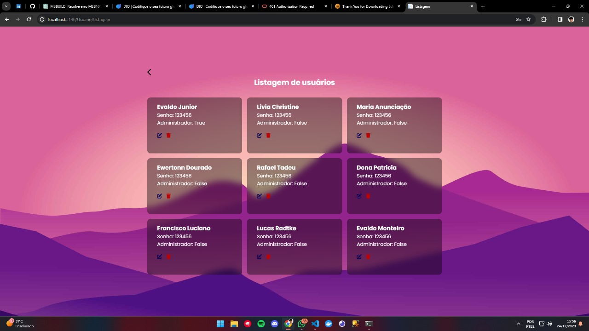
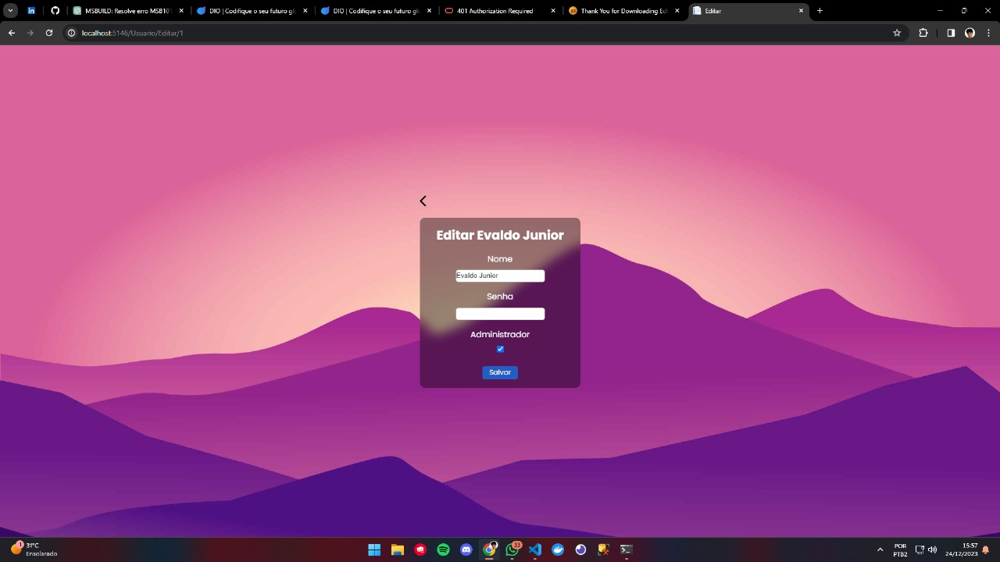
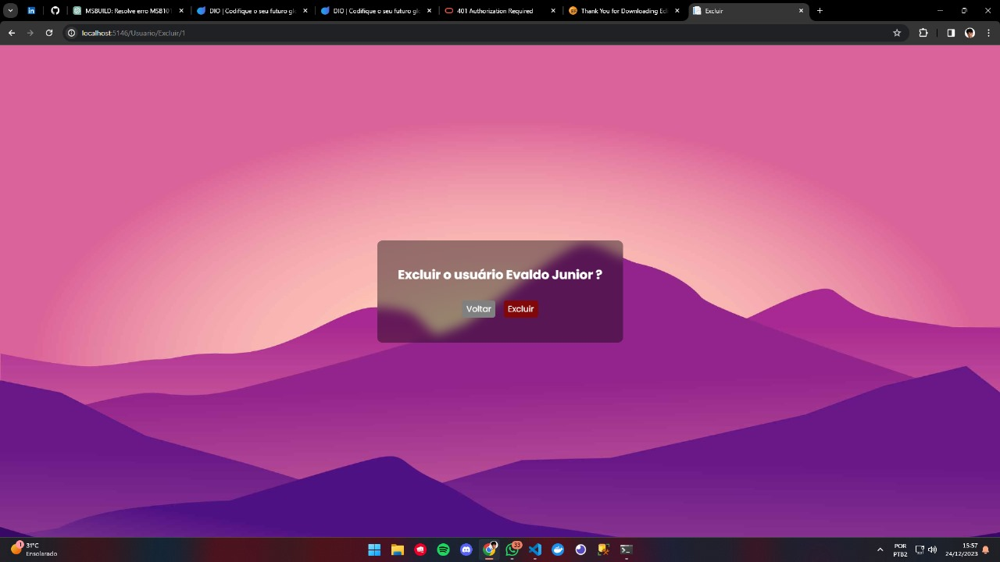

<h1>MVC - Gerenciamento de Usuários</h1>
<h2>O que é?</h2>

Um website em que foi feito um sistema de cadastro e login de usuários para um sistema onde é possível gerenciar os demais usuários do banco de dados do sistema em questão. Caso você seja administrador, você pode alterar alguns atributos dos já existentes usuários ou até mesmo excluí-los. Caso você seja um usuário sem administrador, você ainda assim poderá ver todos os que já estão listados no banco, mas não poderá realizar nenhuma alteração ou exclusão deles.

<h2>Para que foi feito?</h2>

Criei esse projeto com o intuito de criar um Front-End para as minhas APIs que venho desenvolvendo utilizando .NET. Dessa forma, pude criar uma interface interativa na web para cada uma das funcionalidades que desenvolvo em minha controller.

<h2>Como acessar?</h2>

Infelizmente não há um link de acesso para esse projeto. Isso se dá devido aos altos preços cobrados pela Azure e AWS, que são os únicos serviços de nuvem que conheço quando se fala de armazenagem de projetos .NET. Caso alguém tenha alguma sugestão, pode falar comigo em meu linkedin que está anexado na BIO de meu GitHub!

<h2>Imagens</h2>

